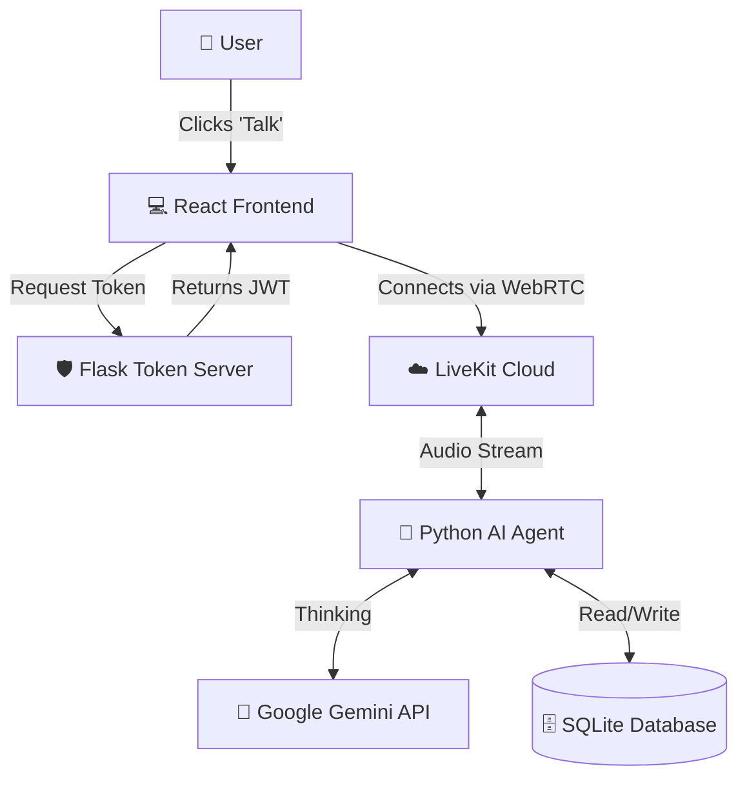

# 🤖 AutoZone AI Voice Agent


**A Full-Stack Real-Time AI Voice Assistant** capable of looking up vehicle information, checking availability, and booking appointments using natural voice commands. Built with **React**, **Python (Flask)**, **LiveKit**, and **Google Gemini Multimodal API**.

---

## 🚀 Features

* **🗣️ Real-Time Voice Conversation:** Low-latency voice interaction using WebRTC (LiveKit).
* **🧠 Multimodal Intelligence:** Powered by Google Gemini Realtime API for natural understanding.
* **🛠️ Tool Calling:** The AI can execute real code to:
    * 🔍 **Lookup Car Details** by VIN (from a local SQLite database).
    * 📅 **Book Appointments** (checking slots and saving to the database).
* **💻 Modern UI:** React Frontend with real-time audio visualization and live chat transcripts.
* **mj Secure Authentication:** Flask backend server for generating unique, secure access tokens.

---

## 🏗️ Architecture & Flow

The system consists of three main parts running simultaneously:

1.  **The Frontend (React):** The user interface.
2.  **The Token Server (Flask):** Grants entry keys (security).
3.  **The AI Agent (Python):** The brain that listens and responds.



---

## 📸 Screenshots

| Landing Page | Active Call |
| --- | --- |
|  |  |

| Chat Transcripts | Console Logs |
| --- | --- |
|  |  |

---

## 🛠️ Tech Stack

* **Frontend:** React (Vite), @livekit/components-react
* **Backend:** Python, Flask, Flask-CORS
* **AI/Media:** LiveKit Agents, Google Gemini Realtime API
* **Database:** SQLite
* **Language:** JavaScript (Frontend), Python (Backend/Agent)

---

## ⚙️ Installation & Setup

### Prerequisites

* Node.js (v18+)
* Python (v3.10+)
* LiveKit Cloud Account (Free tier)
* Google Gemini API Key

### 1. Clone the Repository

```bash
git clone [https://github.com/Hasee10/AI-Voice-Agent-LiveKit.git](https://github.com/Hasee10/AI-Voice-Agent-LiveKit.git)
cd AI-Voice-Agent-LiveKit

```

### 2. Backend Setup (The Brain & Server)

Create a virtual environment and install Python dependencies.

```bash
# Create virtual environment
python -m venv venv

# Activate it
# Windows:
venv\Scripts\activate
# Mac/Linux:
# source venv/bin/activate

# Install dependencies
pip install -r requirements.txt

```

*(Note: If you don't have a `requirements.txt`, install manually: `pip install livekit-agents livekit-plugins-google flask flask-cors python-dotenv`)*

**Configure Environment Variables:**
Create a `.env` file in the root folder and add your keys:

```env
LIVEKIT_URL=wss://your-project-url.livekit.cloud
LIVEKIT_API_KEY=your_api_key
LIVEKIT_API_SECRET=your_api_secret
GOOGLE_API_KEY=your_google_gemini_key

```

### 3. Frontend Setup (The UI)

Navigate to the frontend folder and install dependencies.

```bash
cd frontend
npm install

```

Create a `.env` file in the `frontend` folder:

```env
VITE_LIVEKIT_URL=wss://your-project-url.livekit.cloud

```

---

## 🏃 How to Run (The "3-Terminal" Method)

To run the full application, you need **3 separate terminals** running at the same time.

### Terminal 1: The AI Agent 🧠

This runs the logic that listens and speaks.

```bash
# In root folder (venv activated)
python agent.py dev

```

### Terminal 2: The Token Server 🛡️

This handles security and room creation.

```bash
# In root folder (venv activated)
python server.py

```

*(Runs on http://localhost:5001)*

### Terminal 3: The Frontend 💻

This runs the React website.

```bash
# In frontend folder
npm run dev

```

*(Runs on http://localhost:5173)*

---

## 🧪 Testing the Application

1. Open your browser to `http://localhost:5173`.
2. Click the **"Talk to Agent"** button.
3. **Allow Microphone Access** when prompted.
4. **Try these commands:**
* *"I want to book an appointment."*
* *"Can you look up a car with VIN 3454?"*
* *"What dates are available?"*


---

## 📂 Project Structure

```
AI-Voice-Agent-LiveKit/
├── agent.py                 # Main AI logic (Tools, Gemini connection)
├── server.py                # Flask server for Token generation
├── cars.db                  # SQLite Database (Cars & Appointments)
├── frontend/                # React Project
│   ├── src/
│   │   ├── LiveKitModal.jsx # Handles connection logic
│   │   ├── SimpleVoiceAssistant.jsx # Chat UI & Visualizer
│   │   └── App.jsx          # Main Landing Page
│   └── .env                 # Frontend config
├── .env                     # Backend config (Secrets)
└── README.md                # Documentation

```

---

## 🐛 Troubleshooting

* **Error 404 on `get_token`:** Ensure `server.py` is running on port 5001.
* **Connection Error:** Check if `VITE_LIVEKIT_URL` matches your LiveKit Cloud URL.
* **Agent not responding:** Check Terminal 1 for errors. If Gemini hangs, restart `agent.py`.
* **"Invalid Hook Call":** Ensure you don't have duplicate React versions (Module 4 fix).

---

## 📜 License

This project is open-source and available under the **MIT License**.

```

```
